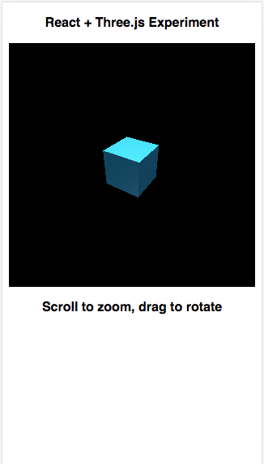

# Create a Three.js rendered cube in React.

This project was built as a 101 introduction to Three.js. Following a few tutorials I built out this project to get a basic understanding of Three.js and how it can interact with React.

This project was bootstrapped with [Create React App](https://github.com/facebook/create-react-app).

Tutorial source [here](https://codeburst.io/react-16-three-js-integration-tips-2019-b6afe19c0b83) [and here](https://github.com/supromikali/react-three-demo)

## Live deme [here](https://keen-yonath-0ba3af.netlify.com/)

## Todos
- Cleanup Global styles, e.g. default margin
- Add normalize css in for more browser support.
- Refactor the class based component into a functional component
See [debouncing event listeners](https://www.pluralsight.com/guides/re-render-react-component-on-window-resize) and [refs in functional components](https://medium.com/@rossbulat/react-using-refs-with-the-useref-hook-884ed25b5c29)

## Available Scripts

In the project directory, you can run:

### `yarn start`

Runs the app in the development mode. 
Open [http://localhost:3000](http://localhost:3000) to view it in the browser.

The page will reload if you make edits. 
You will also see any lint errors in the console.
